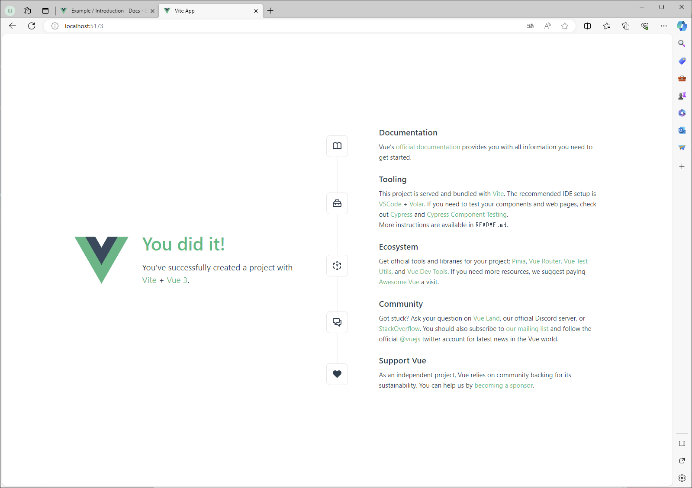
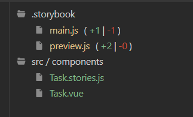
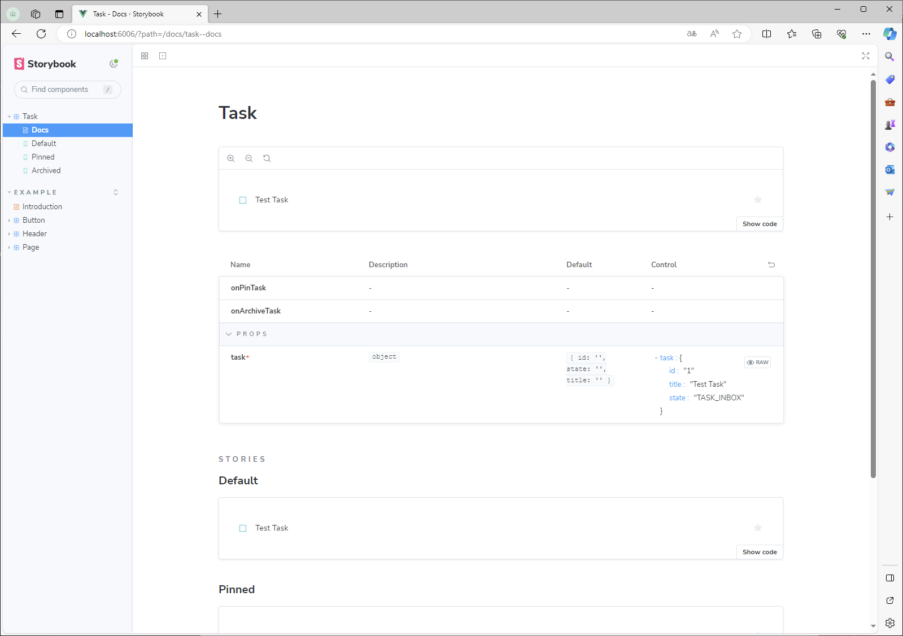
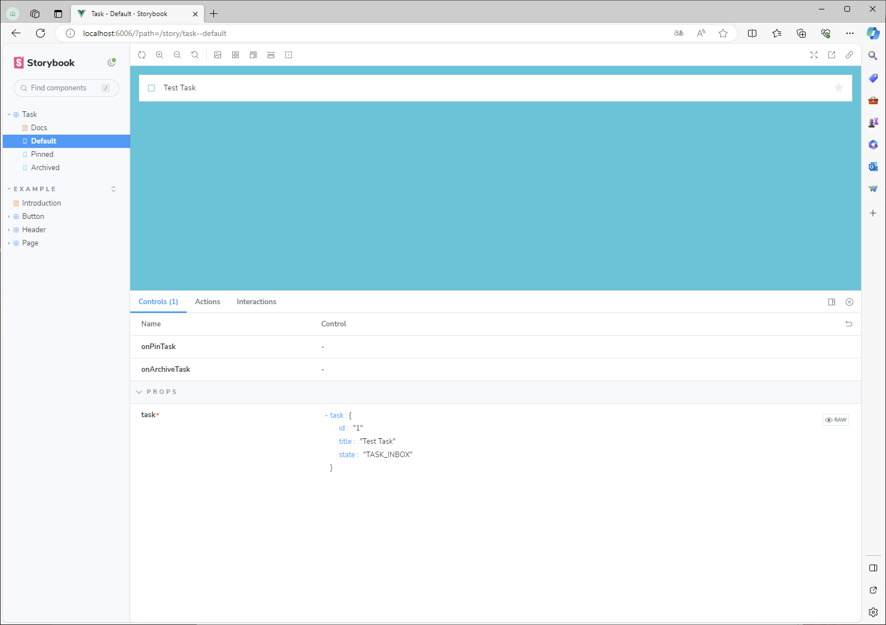
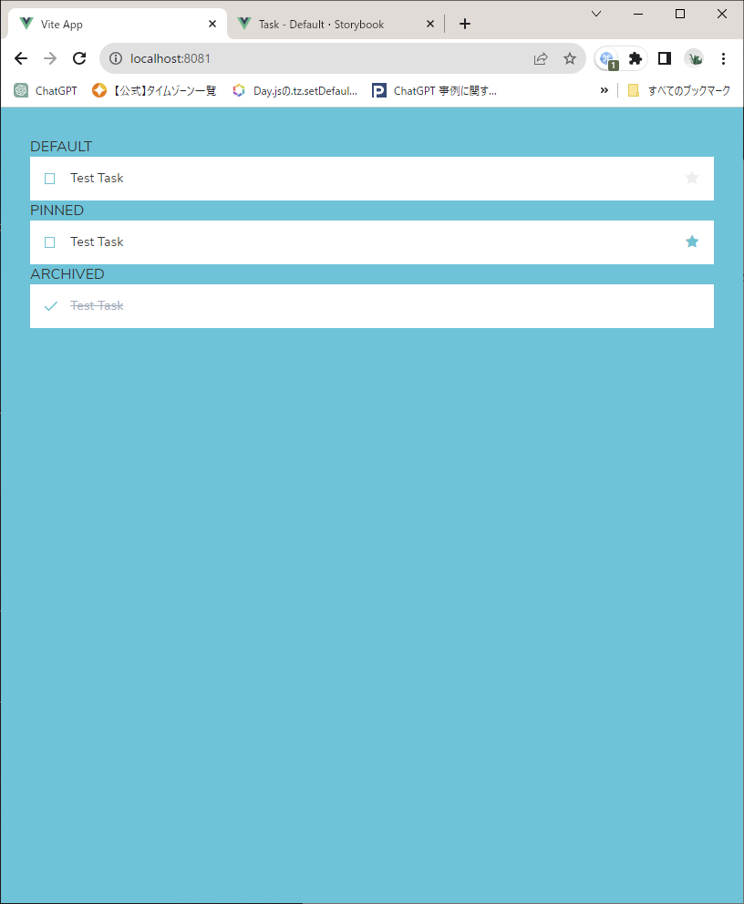
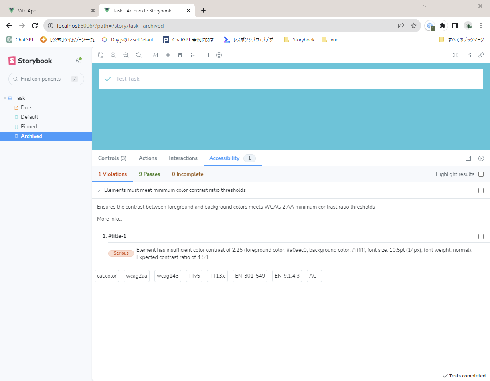
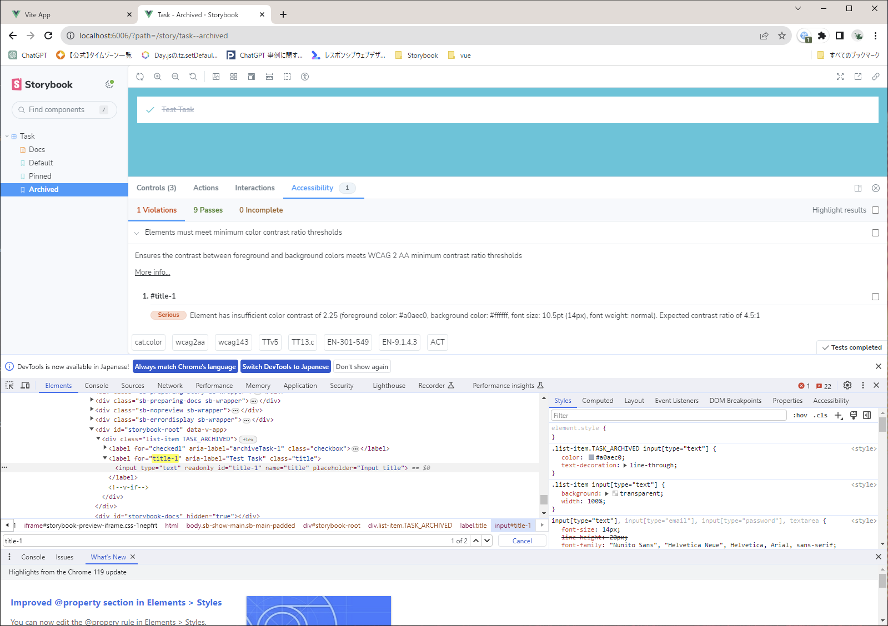
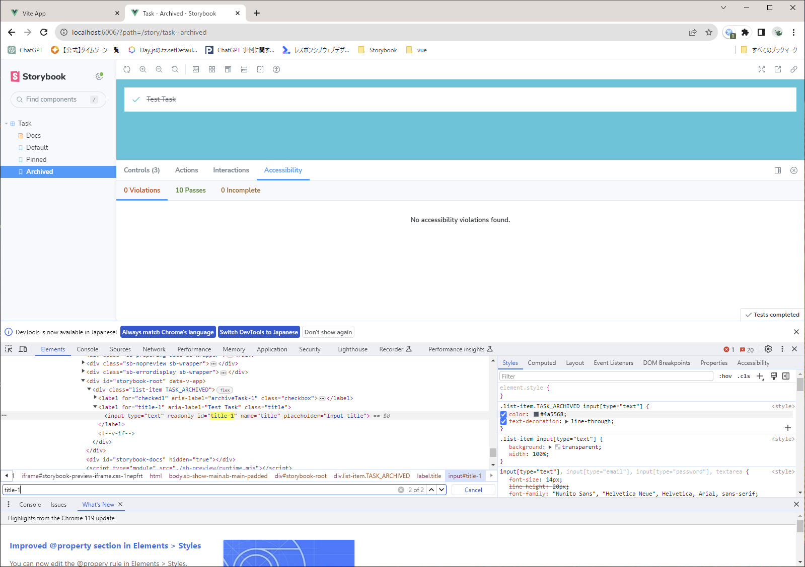
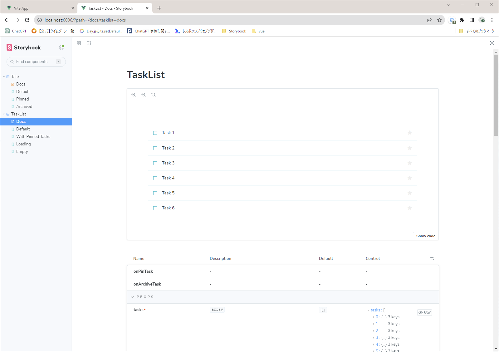
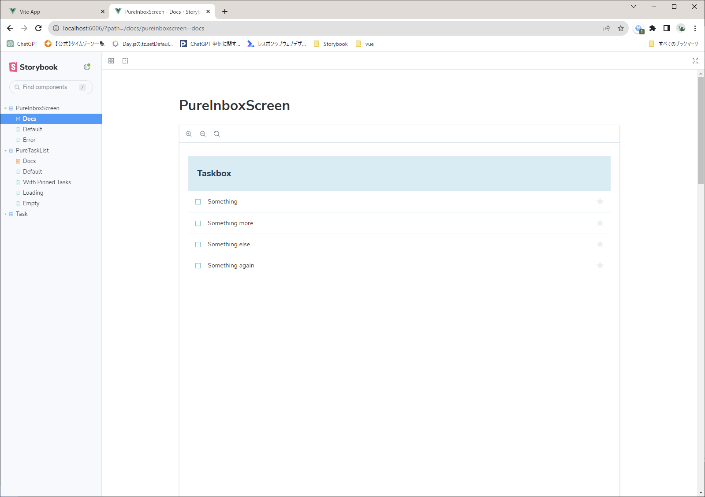

# Set up Vue Storybook

```SHELL
PS C:\dev\storybook\> npx degit chromaui/intro-storybook-vue-template taskbox

PS C:\dev\storybook\> cd taskbox

PS C:\dev\storybook\taskbox> node --version
v18.12.1
PS C:\dev\storybook\taskbox> npm install --global yarn

added 1 package, and audited 2 packages in 1s

found 0 vulnerabilities

PS C:\dev\storybook\taskbox> yarn
yarn install v1.22.19
warning package-lock.json found. Your project contains lock files generated by tools other than Yarn. It is advised not to mix package managers in order to a[1/4] Resolving packages...
[3/4] Linking dependencies...
warning "eslint-plugin-storybook > @typescript-eslint/utils > @typescript-eslint/typescript-estree > tsutils@3.21.0" has unmet peer dependency "typescript@>=2.8.0 || >= 3.2.0-dev || >= 3.3.0-dev || >= 3.4.0-dev || >= 3.5.0-dev || >= 3.6.0-dev || >= 3.6.0-beta || >= 3.7.0-dev || >= 3.7.0-beta".
[4/4] Building fresh packages...
success Saved lockfile.
Done in 57.52s.
PS C:\dev\storybook\taskbox> yarn --version
1.22.19
PS C:\dev\storybook\taskbox> node --version
v18.12.1
PS C:\dev\storybook\taskbox>
```

Storybook起動
```SHELL
yarn storybook
```


アプリケーション起動
```SHELL
yarn dev
```



GITリポジトリ作成
```SHELL
cd C:\dev\storybook
mkdir taskbox.git
cd taskbox.git
git init --bare --shared

cd C:\dev\storybook\taskbox
git init
git add .
git commit -m "first commit"

git remote add origin "C:\dev\storybook\taskbox.git"
git push origin master

```

テスト対象の画面コンポーネント"Task.vue"を作成

"Task.vue"に対応するstory "Task.stories.js"を作成

storiesに含めるため"main.js"を修正

見た目を反映させるため"preview.js"にCSSのリンクをインポート



Taskアプリの開発を進める
src\components\Task.vue





src\App.vueを修正してTaskを設定して同じ結果なのを確認



### アクセシビリティの問題を把握する

Webアクセシビリティ品質を向上/改善するための手引き（ガイドライン）となるWCAG（a11y）とテストを同時に改善する
ストーリーブック公式のアクセシビリティアドオンを取り込む

```SHELL
PS C:\dev\storybook\taskbox> yarn add --dev @storybook/addon-a11y
yarn add v1.22.19
warning package-lock.json found. Your project contains lock files generated by tools other than Yarn. It is advised not to mix package managers in order to avoid resolution inconsistencies caused by unsynchronized lock files. To clear this warning, remove package-lock.json.
[1/4] Resolving packages...
[2/4] Fetching packages...
[3/4] Linking dependencies...
warning "eslint-plugin-storybook > @typescript-eslint/utils > @typescript-eslint/typescript-estree > tsutils@3.21.0" has unmet peer dependency "typescript@>=2.8.0 || >= 3.2.0-dev || >= 3.3.0-dev || >= 3.4.0-dev || >= 3.5.0-dev || >= 3.6.0-dev || >= 3.6.0-beta || >= 3.7.0-dev || >= 3.7.0-beta".
[4/4] Building fresh packages...

success Saved lockfile.
success Saved 33 new dependencies.
info Direct dependencies
└─ @storybook/addon-a11y@7.5.3
info All dependencies
├─ @floating-ui/core@1.5.0
├─ @floating-ui/dom@1.5.3
├─ @floating-ui/react-dom@2.0.2
├─ @radix-ui/number@1.0.1
├─ @radix-ui/react-arrow@1.0.3
├─ @radix-ui/react-dismissable-layer@1.0.4
├─ @radix-ui/react-focus-guards@1.0.1
├─ @radix-ui/react-focus-scope@1.0.3
├─ @radix-ui/react-popper@1.1.2
├─ @radix-ui/react-portal@1.0.3
├─ @radix-ui/react-select@1.2.2
├─ @radix-ui/react-separator@1.0.3
├─ @radix-ui/react-toggle-group@1.0.4
├─ @radix-ui/react-toggle@1.0.3
├─ @radix-ui/react-toolbar@1.0.4
├─ @radix-ui/react-use-escape-keydown@1.0.3
├─ @radix-ui/react-use-previous@1.0.1
├─ @radix-ui/react-use-rect@1.0.1
├─ @radix-ui/react-use-size@1.0.1
├─ @radix-ui/react-visually-hidden@1.0.3
├─ @storybook/addon-a11y@7.5.3
├─ aria-hidden@1.2.3
├─ axe-core@4.8.2
├─ detect-node-es@1.1.0
├─ get-nonce@1.0.1
├─ invariant@2.2.4
├─ react-remove-scroll-bar@2.3.4
├─ react-remove-scroll@2.5.5
├─ react-resize-detector@7.1.2
├─ regenerator-runtime@0.14.0
├─ tiny-invariant@1.3.1
├─ use-callback-ref@1.3.0
└─ use-sidecar@1.1.2
Done in 20.75s.
PS C:\dev\storybook\taskbox> 
```

.storybook/main.jsにアドオンを追加

アドオンがテスト状態の 1 つでアクセシビリティの問題を発見したことがわかります。メッセージ「Elements must meet minimum color contrast ratio thresholds」(要素には十分な色のコントラストが必要です)


タスクのタイトルと背景の間に十分なコントラストがないことを意味します。アプリケーションの CSS ( にありますsrc/index.css) でテキストの色を濃い灰色に変更することで、この問題をすぐに修正する


src/index.cssのcolorを修正




# Composite component
単純なコンポーネントから複合コンポーネントを組み立てる

新規作成：Taskタグを束ねるコンポーネント
```
src\components\TaskList.vue
src\components\TaskList.stories.js
```


複合コンポーネントは、それに含まれる基本コンポーネントと大きな違いはありません。TaskListコンポーネントとそれに付随するストーリー ファイルを作成します



## Data
コンテナのコンポーネント
TaskList現在作成されているコンポーネントは、それ自体の実装の外部とは何も通信しないという点で「プレゼンテーション用」です。データを取り込むには「コンテナ」が必要です。


この例では、ピニア, Vue のデフォルトのデータ管理ライブラリ。アプリ用の簡単なデータ モデルを構築します。ただし、ここで使用されているパターンは、次のような他のデータ管理ライブラリにも同様に当てはまります。

ピニア インストール
```
yarn add pinia
```

新規作成：srcディレクトリ内で呼び出されるタスクの状態を変更するアクションに応答する単純な Pinia ストアを作成
```
src/store.js
```

新規作成:TaskList->PureTaskListと別名にして切り離す
```
src/components/PureTaskList.vue
```

更新：ストアからデータを読み取るように更新する
```
src/components/TaskList.vue
```

## Screens

新規作成:
``` 
src/components/PureInboxScreen.vue
src/components/InboxScreen.vue
```

### yarnの警告解消

````
warning package-lock.json found. Your project contains lock files generated by tools other than Yarn. It is advised not to mix package managers in order to avoid resolution inconsistencies caused by unsynchronized lock files. To clear this warning, remove package-lock.json.
````
このエラーは、Yarnを使用しているプロジェクトでpackage-lock.jsonファイルが見つかったことを示しています。これは、npm（package-lock.jsonを生成する）とYarn（yarn.lockを生成する）のような異なるパッケージマネージャーを混在させると、ロックファイルが同期されないために依存関係の解決に矛盾が生じる可能性があることを警告しています。

削除
```
package-lock.json
```

コマンド実行
```
yarn install
```

### pinia のエラー
エラー
```
X [ERROR] No matching export in "node_modules/vue-demi/lib/index.mjs" for import "hasInjectionContext"

    node_modules/pinia/dist/pinia.mjs:6:9:
      6 │ import { hasInjectionContext, inject, toRaw, watch, unref, markRaw, effect... 
        ╵          ~~~~~~~~~~~~~~~~~~~

10:00:02 [vite] error while updating dependencies:
Error: Build failed with 1 error:
node_modules/pinia/dist/pinia.mjs:6:9: ERROR: No matching export in "node_modules/vue-demi/lib/index.mjs" for import "hasInjectionContext"
    at failureErrorWithLog (C:\dev\storybook\taskbox\node_modules\esbuild\lib\main.js:1636:15)
    at C:\dev\storybook\taskbox\node_modules\esbuild\lib\main.js:1048:25
    at buildResponseToResult (C:\dev\storybook\taskbox\node_modules\esbuild\lib\main.js:1046:7)
    at C:\dev\storybook\taskbox\node_modules\esbuild\lib\main.js:1058:9
    at new Promise (<anonymous>)
    at requestCallbacks.on-end (C:\dev\storybook\taskbox\node_modules\esbuild\lib\main.js:1057:54)
    at handleRequest (C:\dev\storybook\taskbox\node_modules\esbuild\lib\main.js:723:19)
    at handleIncomingPacket (C:\dev\storybook\taskbox\node_modules\esbuild\lib\main.js:745:7)
    at Socket.readFromStdout (C:\dev\storybook\taskbox\node_modules\esbuild\lib\main.js:673:7)
```

対処方法

vueのバージョンを挙げる
```
"vue": "^3.2.47"
"vue": "^3.3.8"

yarn add vue 
```

更新：アプリのエントリ ポイント更新
```
src/main.js
```

更新：レンダリングするコンポーネントを変更
```
src/App.vue
```

追加：ストーリーを追加
```
src/components/PureInboxScreen.stories.js
```


更新：play 関数を使用してインタラクション テストを作成
```
src/components/PureInboxScreen.stories.js
```

## テストランナーを使用してテストを自動化する
```
yarn add --dev @storybook/test-runner
```

```
PS C:\dev\storybook\taskbox> yarn add --dev @storybook/test-runner
yarn add v1.22.19
[1/4] Resolving packages...
[2/4] Fetching packages...
[3/4] Linking dependencies...
warning "eslint-plugin-storybook > @typescript-eslint/utils > @typescript-eslint/typescript-estree > tsutils@3.21.0" has unmet peer dependency "typescript@>=2.8.0 || >= 3.2.0-dev || >= 3.3.0-dev || >= 3.4.0-dev || >= 3.5.0-dev || >= 3.6.0-dev || >= 3.6.0-beta || >= 3.7.0-dev || >= 3.7.0-beta".
[4/4] Building fresh packages...
success Saved lockfile.
success Saved 117 new dependencies.
info Direct dependencies
└─ @storybook/test-runner@0.14.0
info All dependencies
├─ @babel/generator@7.23.3
├─ @babel/plugin-syntax-bigint@7.8.3
├─ @babel/plugin-syntax-import-meta@7.10.4
├─ @babel/plugin-syntax-typescript@7.23.3
├─ @bcoe/v8-coverage@0.2.3
├─ @hapi/topo@5.1.0
├─ @isaacs/cliui@8.0.2
├─ @jest/create-cache-key-function@27.5.1
├─ @jest/globals@29.7.0
├─ @jest/reporters@29.7.0
├─ @jest/source-map@29.6.3
├─ @jest/test-sequencer@29.7.0
├─ @pkgjs/parseargs@0.11.0
├─ @sideway/address@4.1.4
├─ @sideway/formula@3.0.1
├─ @sideway/pinpoint@2.0.0
├─ @sinclair/typebox@0.27.8
├─ @sinonjs/commons@3.0.0
├─ @sinonjs/fake-timers@10.3.0
├─ @storybook/test-runner@0.14.0
├─ @swc/core-win32-x64-msvc@1.3.96
├─ @swc/core@1.3.96
├─ @swc/counter@0.1.2
├─ @swc/jest@0.2.29
├─ @swc/types@0.1.5
├─ @types/stack-utils@2.0.3
├─ @types/wait-on@5.3.4
├─ append-transform@2.0.0
├─ archy@1.0.0
├─ axios@0.21.4
├─ babel-jest@29.7.0
├─ babel-plugin-jest-hoist@29.6.3
├─ babel-preset-jest@29.6.3
├─ caching-transform@4.0.0
├─ can-bind-to-host@1.1.2
├─ char-regex@1.0.2
├─ cjs-module-lexer@1.2.3
├─ co@4.6.0
├─ commander@9.5.0
├─ create-jest@29.7.0
├─ cwd@0.10.0
├─ dedent@1.5.1
├─ deepmerge@4.3.1
├─ default-require-extensions@3.0.1
├─ detect-newline@3.1.0
├─ diff-sequences@29.6.3
├─ diffable-html@4.1.0
├─ dom-serializer@0.2.2
├─ domhandler@2.4.2
├─ domutils@1.7.0
├─ eastasianwidth@0.2.0
├─ entities@1.1.2
├─ es6-error@4.1.1
├─ expand-tilde@1.2.2
├─ find-file-up@0.1.3
├─ find-pkg@0.1.2
├─ find-process@1.4.7
├─ follow-redirects@1.15.3
├─ fromentries@1.3.2
├─ global-modules@0.2.3
├─ global-prefix@0.1.5
├─ hasown@2.0.0
├─ homedir-polyfill@1.0.3
├─ html-escaper@2.0.2
├─ htmlparser2@3.10.1
├─ ini@1.3.8
├─ is-generator-fn@2.1.0
├─ istanbul-lib-hook@3.0.0
├─ istanbul-lib-processinfo@2.0.3
├─ istanbul-reports@3.1.6
├─ jackspeak@2.3.6
├─ jest-changed-files@29.7.0
├─ jest-circus@29.7.0
├─ jest-cli@29.7.0
├─ jest-docblock@29.7.0
├─ jest-each@29.7.0
├─ jest-junit@16.0.0
├─ jest-leak-detector@29.7.0
├─ jest-playwright-preset@3.0.1
├─ jest-pnp-resolver@1.2.3
├─ jest-process-manager@0.3.1
├─ jest-resolve-dependencies@29.7.0
├─ jest-serializer-html@7.1.0
├─ jest-watch-typeahead@2.2.2
├─ jest@29.7.0
├─ joi@17.11.0
├─ jsonc-parser@3.2.0
├─ lodash.flattendeep@4.4.0
├─ node-preload@0.2.1
├─ nyc@15.1.0
├─ os-homedir@1.0.2
├─ package-hash@4.0.0
├─ parse-passwd@1.0.0
├─ path-scurry@1.10.1
├─ playwright-core@1.39.0
├─ playwright@1.39.0
├─ pure-rand@6.0.4
├─ react-is@18.2.0
├─ release-zalgo@1.0.0
├─ require-main-filename@2.0.0
├─ resolve-cwd@3.0.0
├─ resolve-dir@0.1.1
├─ resolve.exports@2.0.2
├─ source-map-support@0.5.13
├─ spawn-wrap@2.0.0
├─ spawnd@5.0.0
├─ string-width-cjs@4.2.3
├─ strip-ansi-cjs@6.0.1
├─ type-detect@4.0.8
├─ typedarray-to-buffer@3.1.5
├─ undici-types@5.26.5
├─ v8-to-istanbul@9.1.3
├─ wait-on@5.3.0
├─ wait-port@0.2.14
├─ which-module@2.0.1
├─ wrap-ansi-cjs@7.0.0
└─ xml@1.0.1
Done in 55.16s.
PS C:\dev\storybook\taskbox> 
```

更新:テスト タスクを更新して新しいテスト タスクを追加
```
package.json
```

Storybook を実行した状態で、新しいターミナル ウィンドウを開いて次のコマンドを実行
```
yarn test-storybook --watch
```

```
Ran all test suites related to changed files.


  ● Test suite failed to run

    Executable doesn't exist at C:\Users\takao.yamada\AppData\Local\ms-playwright\chromium-1084\chrome-win\chrome.exe 
    ╔═════════════════════════════════════════════════════════════════════════╗
    ║ Looks like Playwright Test or Playwright was just installed or updated. ║
    ║ Please run the following command to download new browsers:              ║
    ║                                                                         ║
    ║     yarn playwright install                                             ║
    ║                                                                         ║
    ║ <3 Playwright Team                                                      ║
    ╚═════════════════════════════════════════════════════════════════════════╝ Failed to launch browser.

      at executablePathOrDie (node_modules/playwright-core/lib/server/registry/index.js:357:15)
      at Object.executablePathOrDie (node_modules/playwright-core/lib/server/registry/index.js:370:43)
      at Chromium._launchProcess (node_modules/playwright-core/lib/server/browserType.js:166:39)
      at async Chromium._innerLaunch (node_modules/playwright-core/lib/server/browserType.js:103:9)
      at async Chromium._innerLaunchWithRetries (node_modules/playwright-core/lib/server/browserType.js:84:14)        
      at async ProgressController.run (node_modules/playwright-core/lib/server/progress.js:92:22)
      at async Chromium.launch (node_modules/playwright-core/lib/server/browserType.js:61:21)
      at async BrowserServerLauncherImpl.launchServer (node_modules/playwright-core/lib/browserServerImpl.js:48:21)   
      at async PlaywrightRunner.launchServer (node_modules/jest-playwright-preset/lib/PlaywrightRunner.js:69:44)      
      at async PlaywrightRunner.getTests (node_modules/jest-playwright-preset/lib/PlaywrightRunner.js:90
```

playwrightを更新
```
yarn playwright install 
```

再実行
```
yarn test-storybook --watch
```
 PASS   browser: chromium  src/components/PureInboxScreen.stories.js
  PureInboxScreen
    Default
      √ smoke-test (93 ms)
    Error
      √ smoke-test (20 ms)
    WithInteractions
      √ play-test (25 ms)

Test Suites: 1 passed, 1 total
Tests:       3 passed, 3 total
Snapshots:   0 total
Time:        5.405 s
Ran all test suites related to changed files.

Watch Usage
 › Press a to run all tests.
 › Press f to run only failed tests.
 › Press q to quit watch mode.
 › Press p to filter by a filename regex pattern.
 › Press t to filter by a test name regex pattern.
 › Press Enter to trigger a test run.
```

